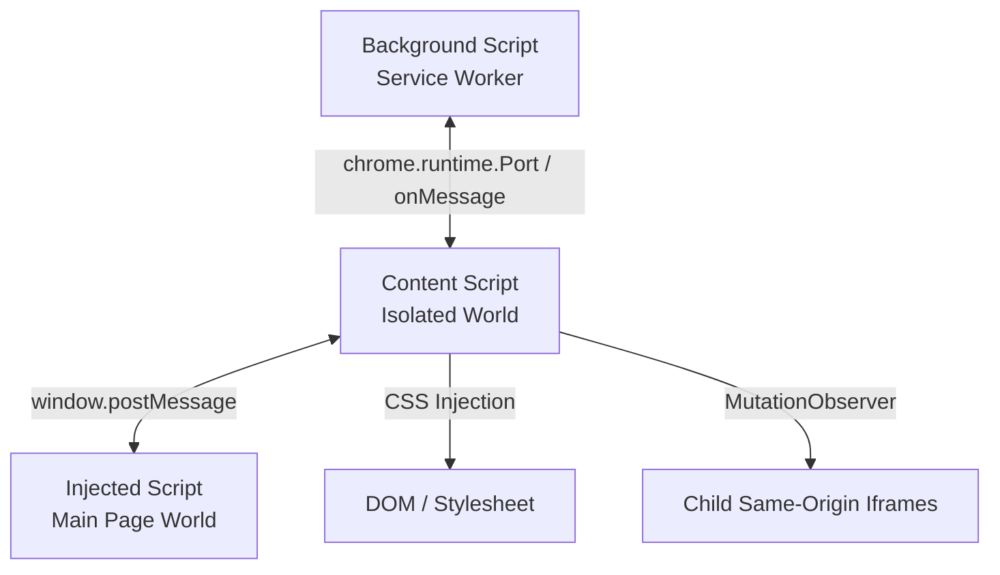

# Extension Architecture

This document provides a high-level overview of the LinkedIn Full Width extension's architecture, entrypoints, and communication flows.

## Component Overview

The extension is composed of three main layers that run in different execution environments:

### 1. [Background Script](file:///Users/democle/Documents/linkedin-full-width-extension/entrypoints/background.ts)
* **Environment:** Extension service worker (background context).
* **Responsibilities:**
  * Coordinates and persists extension state (using `browser.storage.local`).
  * Listens for tab updates (`onUpdated`) and extension installation/updates (`onInstalled`).
  * Programmatically injects the content script into all frames (using `browser.scripting.executeScript` with `allFrames: true`) when LinkedIn tabs load.
  * Listens for the toolbar action button clicks to toggle between XL (full width) and M (default width) states, and broadcasts this toggle message to all active LinkedIn tabs.

### 2. [Content Script](file:///Users/democle/Documents/linkedin-full-width-extension/entrypoints/content/index.ts)
* **Environment:** Extension Isolated World (has DOM access but runs in a separate JS sandbox).
* **Responsibilities:**
  * Dynamically adds and removes the `<style id="linkedin-full-width-style">` element containing the CSS from [`content.css`](file:///Users/democle/Documents/linkedin-full-width-extension/entrypoints/content/content.css).
  * Watches for LinkedIn SPA navigation where the page inserts dynamic, same-origin iframes (via `observeIframes` MutationObserver) and ensures they get the full-width styles.
  * Injects the main page-world script (`/inject-script.js`).
  * Handles message relay between the background script and the injected script.

### 3. [Injected Script](file:///Users/democle/Documents/linkedin-full-width-extension/public/inject-script.js)
* **Environment:** Main Page World (runs directly inside the LinkedIn page's JS environment).
* **Responsibilities:**
  * Interacts with any page-context events or variables if required.
  * Implements a heartbeat (`injectedScriptReady` / `heartbeat` messages) via `window.postMessage` to keep the content script-to-background connection alive and active.

---

## Communication & State Management Flow

1. **Initialization:**
   * When a LinkedIn tab loads, the **Background Script** executes the content script inside all frames.
   * The **Content Script** queries the current state (`XL` or `M`) from `browser.storage.local`.
   * It applies the layout CSS if the state is `XL`.
   * It starts the `MutationObserver` (`observeIframes`) to handle future dynamically-loaded same-origin iframes.
   * It injects the **Injected Script**, which connects and signals readiness back to the content script.
   * The **Content Script** registers a connection port (`content-script-connection`) with the background script.

2. **Toggling States:**
   * User clicks the extension action icon.
   * **Background Script** toggles the stored state (`XL` ↔ `M`), updates the extension badge text, and sends a `toggleStyles` message to all active LinkedIn tab frames.
   * **Content Script** receives the message and invokes `toggleStyles(state)`:
     * Inserts/removes stylesheet in the main document.
     * Recursively inserts/removes stylesheet in all same-origin child iframes.
     * Posts a message to the page-world **Injected Script** in case any main-world adjustments are required.

---

## Layout Customization

The full-width styles reside in [`entrypoints/content/content.css`](file:///Users/democle/Documents/linkedin-full-width-extension/entrypoints/content/content.css). WXT loads this CSS inline, and the content script applies it as a `<style>` element.

* **Main elements targetted:**
  * `:root` layout variables (e.g. `--scaffold-layout-xl-max-width: 100% !important`).
  * Layout containers (`.scaffold-layout-container`, `.scaffold-layout-container--reflow`).
  * Navigation headers (`.global-nav__content`, `#root header div`).
  * Workspace/Homepage main grids and feeds.
